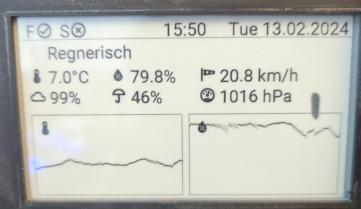

# ESPHome.EInkDisplay

I had a [lilygo display](https://www.lilygo.cc/products/t5-4-7-inch-e-paper) flying around with ESP32 and a 4.7 inch eink panel. With esphome I turned it into a simple display for weather data and (in the future) some more home assistant data and statistics and stuff.

Not much to say about the integration, the biggest issue is the outdated external driver for the panel. A patch is included and must be applied after the first unsuccessful build.

Todo:

- Try the newer [fork](https://github.com/neturmel/esphome-components2) or send a PR
- Page with server stats
- Do something useful with the button
